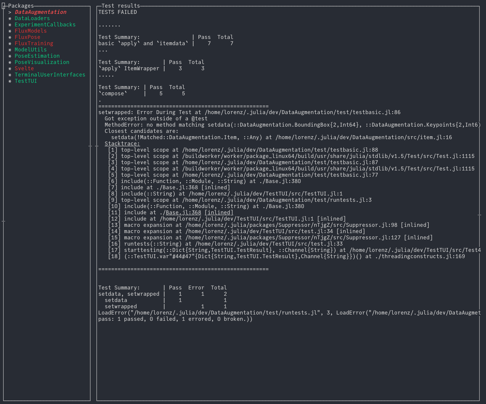

# TestTUI

Finds in-development packages, runs their tests and shows you the results.

Usage:

```julia
using Pkg; Pkg.add("https://github.com/lorenzoh/TestTUI.jl")
using TestTUI
testui()  # searches JULIA_DEV_DIR by default
```

## Features

- package discovery
- rerun tests on file change
- capture and show test output

## Screenshot

